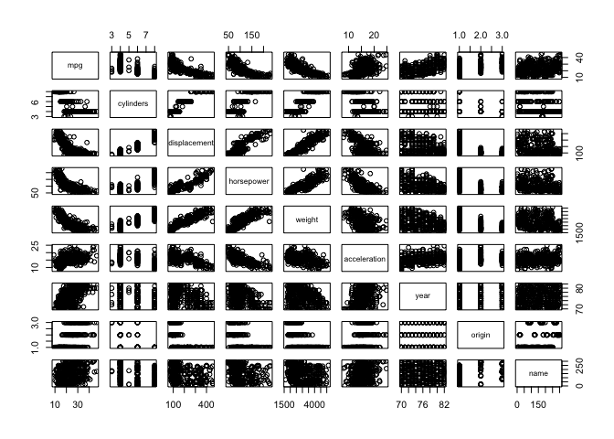
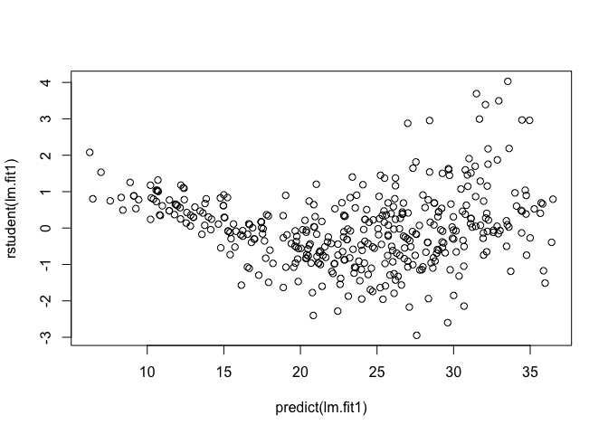
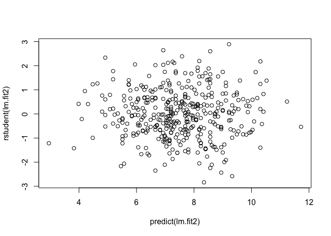
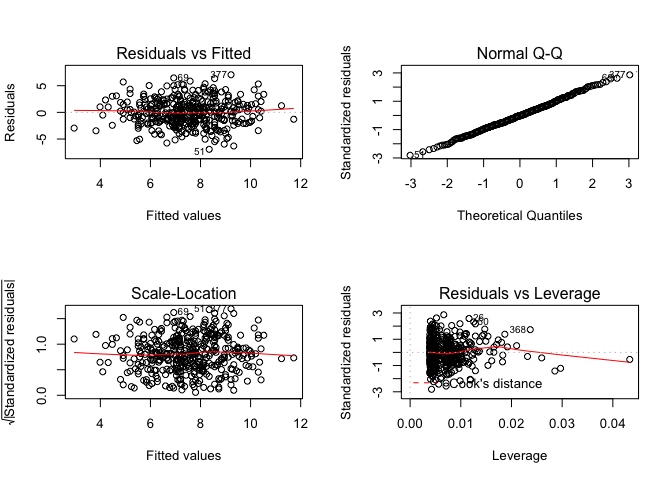
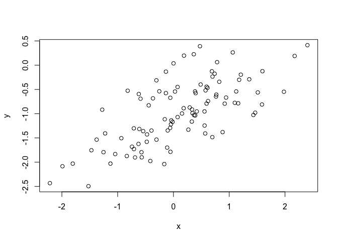
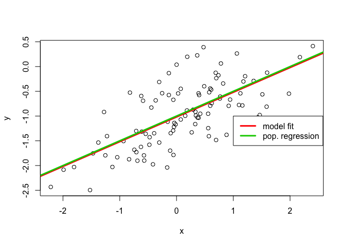
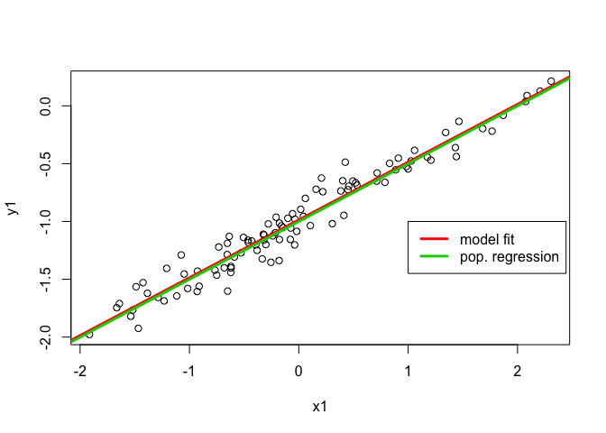
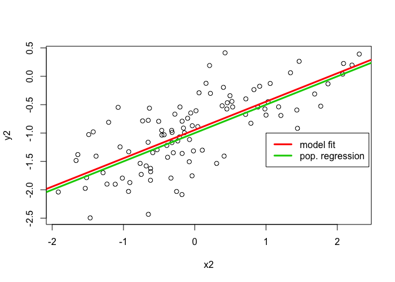

Lab 4 - Linear Regression
================
Ken Benoit and Slava Mikhaylov

``` r
library(ISLR)
```

## Exercise 4.1

This question involves the use of multiple linear regression on the
`Auto` data set.

1)  Produce a scatterplot matrix which includes all of the variables in
    the data
set.

<!-- end list -->

``` r
pairs(Auto)
```

<!-- -->

2)  Compute the matrix of correlations between the variables using the
    function `cor()`. You will need to exclude the `name` variable,
    which is
    qualitative.

<!-- end list -->

``` r
cor(subset(Auto, select = -name))
```

    ##                     mpg  cylinders displacement horsepower     weight
    ## mpg           1.0000000 -0.7776175   -0.8051269 -0.7784268 -0.8322442
    ## cylinders    -0.7776175  1.0000000    0.9508233  0.8429834  0.8975273
    ## displacement -0.8051269  0.9508233    1.0000000  0.8972570  0.9329944
    ## horsepower   -0.7784268  0.8429834    0.8972570  1.0000000  0.8645377
    ## weight       -0.8322442  0.8975273    0.9329944  0.8645377  1.0000000
    ## acceleration  0.4233285 -0.5046834   -0.5438005 -0.6891955 -0.4168392
    ## year          0.5805410 -0.3456474   -0.3698552 -0.4163615 -0.3091199
    ## origin        0.5652088 -0.5689316   -0.6145351 -0.4551715 -0.5850054
    ##              acceleration       year     origin
    ## mpg             0.4233285  0.5805410  0.5652088
    ## cylinders      -0.5046834 -0.3456474 -0.5689316
    ## displacement   -0.5438005 -0.3698552 -0.6145351
    ## horsepower     -0.6891955 -0.4163615 -0.4551715
    ## weight         -0.4168392 -0.3091199 -0.5850054
    ## acceleration    1.0000000  0.2903161  0.2127458
    ## year            0.2903161  1.0000000  0.1815277
    ## origin          0.2127458  0.1815277  1.0000000

3)  Use the `lm()` function to perform a multiple linear regression with
    `mpg` as the response and all other variables except `name` as the
    predictors. Use the `summary()` function to print the results.
    Comment on the output. For instance:

<!-- end list -->

``` r
lm.fit1 <-  lm(mpg ~ .-name, data=Auto)
summary(lm.fit1)
```

    ## 
    ## Call:
    ## lm(formula = mpg ~ . - name, data = Auto)
    ## 
    ## Residuals:
    ##     Min      1Q  Median      3Q     Max 
    ## -9.5903 -2.1565 -0.1169  1.8690 13.0604 
    ## 
    ## Coefficients:
    ##                Estimate Std. Error t value Pr(>|t|)    
    ## (Intercept)  -17.218435   4.644294  -3.707  0.00024 ***
    ## cylinders     -0.493376   0.323282  -1.526  0.12780    
    ## displacement   0.019896   0.007515   2.647  0.00844 ** 
    ## horsepower    -0.016951   0.013787  -1.230  0.21963    
    ## weight        -0.006474   0.000652  -9.929  < 2e-16 ***
    ## acceleration   0.080576   0.098845   0.815  0.41548    
    ## year           0.750773   0.050973  14.729  < 2e-16 ***
    ## origin         1.426141   0.278136   5.127 4.67e-07 ***
    ## ---
    ## Signif. codes:  0 '***' 0.001 '**' 0.01 '*' 0.05 '.' 0.1 ' ' 1
    ## 
    ## Residual standard error: 3.328 on 384 degrees of freedom
    ## Multiple R-squared:  0.8215, Adjusted R-squared:  0.8182 
    ## F-statistic: 252.4 on 7 and 384 DF,  p-value: < 2.2e-16

    i. Is there a relationship between the predictors and the response?

**Yes, there is a relatioship between the predictors and the response by
testing the null hypothesis of whether all the regression coefficients
are zero. The F-statistic is far from 1 (with a small p-value),
indicating evidence against the null
    hypothesis.**

    ii. Which predictors appear to have a statistically significant relationship to the response?

**Looking at the p-values associated with each predictor’s t-statistic,
we see that displacement, weight, year, and origin have a statistically
significant relationship, while cylinders, horsepower, and acceleration
do not.**

    iii. What does the coefficient for the `year` variable suggest?

**The regression coefficient for year, `0.7507727`, suggests that for
every one year, mpg increases by the coefficient. In other words, cars
become more fuel efficient every year by almost 1 mpg / year.**

4)  Use the `plot()` function to produce diagnostic plots of the linear
    regression fit. Comment on any problems you see with the fit. Do the
    residual plots suggest any unusually large outliers? Does the
    leverage plot identify any observations with unusually high
    leverage?

<!-- end list -->

``` r
par(mfrow=c(2,2))
plot(lm.fit1)
```

<!-- -->
**Seems to be non-linear pattern, linear model not the best fit. From
the leverage plot, point 14 appears to have high leverage, although not
a high magnitude
residual.**

``` r
plot(predict(lm.fit1), rstudent(lm.fit1))
```

<!-- -->
**There are possible outliers as seen in the plot of studentized
residuals because there are data with a value greater than 3.**

5)  Use the `*` and `:` symbols to fit linear regression models with
    interaction effects. Do any interactions appear to be statistically
    significant?

<!-- end list -->

``` r
lm.fit2 <-  lm(mpg ~ cylinders * displacement + displacement * weight, data=Auto)
summary(lm.fit2)
```

    ## 
    ## Call:
    ## lm(formula = mpg ~ cylinders * displacement + displacement * 
    ##     weight, data = Auto)
    ## 
    ## Residuals:
    ##      Min       1Q   Median       3Q      Max 
    ## -13.2934  -2.5184  -0.3476   1.8399  17.7723 
    ## 
    ## Coefficients:
    ##                          Estimate Std. Error t value Pr(>|t|)    
    ## (Intercept)             5.262e+01  2.237e+00  23.519  < 2e-16 ***
    ## cylinders               7.606e-01  7.669e-01   0.992    0.322    
    ## displacement           -7.351e-02  1.669e-02  -4.403 1.38e-05 ***
    ## weight                 -9.888e-03  1.329e-03  -7.438 6.69e-13 ***
    ## cylinders:displacement -2.986e-03  3.426e-03  -0.872    0.384    
    ## displacement:weight     2.128e-05  5.002e-06   4.254 2.64e-05 ***
    ## ---
    ## Signif. codes:  0 '***' 0.001 '**' 0.01 '*' 0.05 '.' 0.1 ' ' 1
    ## 
    ## Residual standard error: 4.103 on 386 degrees of freedom
    ## Multiple R-squared:  0.7272, Adjusted R-squared:  0.7237 
    ## F-statistic: 205.8 on 5 and 386 DF,  p-value: < 2.2e-16

**Interaction between displacement and weight is statistically
signifcant, while the interactiion between cylinders and displacement is
not.**

## Exercise 4.2

This question should be answered using the `Carseats` dataset from the
`ISLR` package.

1)  Fit a multiple regression model to predict `Sales` using `Price`,
    `Urban`, and `US`.

<!-- end list -->

``` r
library(ISLR)
summary(Carseats)
```

    ##      Sales          CompPrice       Income        Advertising    
    ##  Min.   : 0.000   Min.   : 77   Min.   : 21.00   Min.   : 0.000  
    ##  1st Qu.: 5.390   1st Qu.:115   1st Qu.: 42.75   1st Qu.: 0.000  
    ##  Median : 7.490   Median :125   Median : 69.00   Median : 5.000  
    ##  Mean   : 7.496   Mean   :125   Mean   : 68.66   Mean   : 6.635  
    ##  3rd Qu.: 9.320   3rd Qu.:135   3rd Qu.: 91.00   3rd Qu.:12.000  
    ##  Max.   :16.270   Max.   :175   Max.   :120.00   Max.   :29.000  
    ##    Population        Price        ShelveLoc        Age       
    ##  Min.   : 10.0   Min.   : 24.0   Bad   : 96   Min.   :25.00  
    ##  1st Qu.:139.0   1st Qu.:100.0   Good  : 85   1st Qu.:39.75  
    ##  Median :272.0   Median :117.0   Medium:219   Median :54.50  
    ##  Mean   :264.8   Mean   :115.8                Mean   :53.32  
    ##  3rd Qu.:398.5   3rd Qu.:131.0                3rd Qu.:66.00  
    ##  Max.   :509.0   Max.   :191.0                Max.   :80.00  
    ##    Education    Urban       US     
    ##  Min.   :10.0   No :118   No :142  
    ##  1st Qu.:12.0   Yes:282   Yes:258  
    ##  Median :14.0                      
    ##  Mean   :13.9                      
    ##  3rd Qu.:16.0                      
    ##  Max.   :18.0

``` r
attach(Carseats)
lm.fit <-  lm(Sales ~ Price + Urban + US)
summary(lm.fit)
```

    ## 
    ## Call:
    ## lm(formula = Sales ~ Price + Urban + US)
    ## 
    ## Residuals:
    ##     Min      1Q  Median      3Q     Max 
    ## -6.9206 -1.6220 -0.0564  1.5786  7.0581 
    ## 
    ## Coefficients:
    ##              Estimate Std. Error t value Pr(>|t|)    
    ## (Intercept) 13.043469   0.651012  20.036  < 2e-16 ***
    ## Price       -0.054459   0.005242 -10.389  < 2e-16 ***
    ## UrbanYes    -0.021916   0.271650  -0.081    0.936    
    ## USYes        1.200573   0.259042   4.635 4.86e-06 ***
    ## ---
    ## Signif. codes:  0 '***' 0.001 '**' 0.01 '*' 0.05 '.' 0.1 ' ' 1
    ## 
    ## Residual standard error: 2.472 on 396 degrees of freedom
    ## Multiple R-squared:  0.2393, Adjusted R-squared:  0.2335 
    ## F-statistic: 41.52 on 3 and 396 DF,  p-value: < 2.2e-16

2)  Provide an interpretation of each coefficient in the model. Be
    careful—some of the variables in the model are qualitative\!

**Price: suggests a relationship between price and sales given the low
p-value of the t-statistic. The coefficient states a negative
relationship between Price and Sales: as Price increases, Sales
decreases.**

**UrbanYes: The linear regression suggests that there is not enough
evidence for arelationship between the location of the store and the
number of sales based.**

**USYes: Suggests there is a relationship between whether the store is
in the US or not and the amount of sales. A positive relationship
between USYes and Sales: if the store is in the US, the sales will
increase by approximately 1201 units.**

3)  Write out the model in equation form, being careful to handle the
    qualitative variables properly.

**Sales = 13.04 + -0.05 Price + -0.02 UrbanYes + 1.20 USYes**

4)  For which of the predictors can you reject the null hypothesis
    \(H_0 : \beta_j =0\)?

**Price and USYes, based on the p-values, F-statistic, and p-value of
the F-statistic.**

5)  On the basis of your response to the previous question, fit a
    smaller model that only uses the predictors for which there is
    evidence of association with the outcome.

<!-- end list -->

``` r
lm.fit2 <-  lm(Sales ~ Price + US)
summary(lm.fit2)
```

    ## 
    ## Call:
    ## lm(formula = Sales ~ Price + US)
    ## 
    ## Residuals:
    ##     Min      1Q  Median      3Q     Max 
    ## -6.9269 -1.6286 -0.0574  1.5766  7.0515 
    ## 
    ## Coefficients:
    ##             Estimate Std. Error t value Pr(>|t|)    
    ## (Intercept) 13.03079    0.63098  20.652  < 2e-16 ***
    ## Price       -0.05448    0.00523 -10.416  < 2e-16 ***
    ## USYes        1.19964    0.25846   4.641 4.71e-06 ***
    ## ---
    ## Signif. codes:  0 '***' 0.001 '**' 0.01 '*' 0.05 '.' 0.1 ' ' 1
    ## 
    ## Residual standard error: 2.469 on 397 degrees of freedom
    ## Multiple R-squared:  0.2393, Adjusted R-squared:  0.2354 
    ## F-statistic: 62.43 on 2 and 397 DF,  p-value: < 2.2e-16

6)  How well do the models in (a) and (e) fit the data?

**Based on the RSE and R^2 of the linear regressions, they both fit the
data similarly, with linear regression from (e) fitting the data
slightly better.**

7)  Using the model from (e), obtain 95% confidence intervals for the
    coefficient(s).

<!-- end list -->

``` r
confint(lm.fit2)
```

    ##                   2.5 %      97.5 %
    ## (Intercept) 11.79032020 14.27126531
    ## Price       -0.06475984 -0.04419543
    ## USYes        0.69151957  1.70776632

8)  Is there evidence of outliers or high leverage observations in the
    model from
(e)?

<!-- end list -->

``` r
plot(predict(lm.fit2), rstudent(lm.fit2))
```

<!-- -->

**All studentized residuals appear to be bounded by -3 to 3, so no
potential outliers are suggested from the linear regression.**

``` r
par(mfrow=c(2,2))
plot(lm.fit2)
```

<!-- -->
**There are a few observations that greatly exceed \((p+1)/n\)
(`0.0075567`) on the leverage-statistic plot that suggest that the
corresponding points have high leverage.**

## Exercise 4.3 (Optional)

In this exercise you will create some simulated data and will fit simple
linear regression models to it. Make sure to use `set.seed(1)` prior to
starting part (a) to ensure consistent results.

1)  Using the `rnorm()` function, create a vector, `x`, containing 100
    observations drawn from a \(N(0,1)\) distribution. This represents a
    feature, `X`.

<!-- end list -->

``` r
set.seed(1)
x <- rnorm(100)
```

2)  Using the `rnorm()` function, create a vector, `eps`, containing 100
    observations drawn from a \(N(0,0.25)\) distribution i.e. a normal
    distribution with mean zero and variance 0.25.

<!-- end list -->

``` r
eps <- rnorm(100, 0, sqrt(0.25))
```

3)  Using `x` and `eps`, generate a vector `y` according to the model
    \[Y = −1 + 0.5X + \epsilon\] What is the length of the vector `y`?
    What are the values of \(\beta_0\) and \(\beta_1\) in this linear
    model?

<!-- end list -->

``` r
y = -1 + 0.5*x + eps
```

**y is of length 100. \(\beta_0\) is -1, \(\beta_1\) is 0.5.**

4)  Create a scatterplot displaying the relationship between `x` and
    `y`. Comment on what you
observe.

<!-- end list -->

``` r
plot(x, y)
```

<!-- -->

**A linear relationship between x and y with a positive slope, with a
variance as is to be expected.**

5)  Fit a least squares linear model to predict `y` using `x`. Comment
    on the model obtained. How do \(\hat{\beta}_0\) and
    \(\hat{\beta}_1\) compare to \(\beta_0\) and \(\beta_1\)?

<!-- end list -->

``` r
lm.fit <-  lm(y ~ x)
summary(lm.fit)
```

    ## 
    ## Call:
    ## lm(formula = y ~ x)
    ## 
    ## Residuals:
    ##      Min       1Q   Median       3Q      Max 
    ## -0.93842 -0.30688 -0.06975  0.26970  1.17309 
    ## 
    ## Coefficients:
    ##             Estimate Std. Error t value Pr(>|t|)    
    ## (Intercept) -1.01885    0.04849 -21.010  < 2e-16 ***
    ## x            0.49947    0.05386   9.273 4.58e-15 ***
    ## ---
    ## Signif. codes:  0 '***' 0.001 '**' 0.01 '*' 0.05 '.' 0.1 ' ' 1
    ## 
    ## Residual standard error: 0.4814 on 98 degrees of freedom
    ## Multiple R-squared:  0.4674, Adjusted R-squared:  0.4619 
    ## F-statistic: 85.99 on 1 and 98 DF,  p-value: 4.583e-15

**The linear regression fits a model close to the true value of the
coefficients as was constructed. The model has a large F-statistic with
a near-zero p-value so the null hypothesis can be rejected.**

6)  Display the least squares line on the scatterplot obtained in (d).
    Draw the population regression line on the plot, in a different
    color. Use the `legend()` command to create an appropriate legend.

<!-- end list -->

``` r
plot(x, y)
abline(lm.fit, lwd=3, col=2)
abline(-1, 0.5, lwd=3, col=3)
legend(-1, legend = c("model fit", "pop. regression"), col=2:3, lwd=3)
```

<!-- -->

7)  Now fit a polynomial regression model that predicts \(y\) using
    \(x\) and \(x^2\). Is there evidence that the quadratic term
    improves the model fit? Explain your answer.

<!-- end list -->

``` r
lm.fit_sq <-  lm(y ~ x + I(x^2))
summary(lm.fit_sq)
```

    ## 
    ## Call:
    ## lm(formula = y ~ x + I(x^2))
    ## 
    ## Residuals:
    ##      Min       1Q   Median       3Q      Max 
    ## -0.98252 -0.31270 -0.06441  0.29014  1.13500 
    ## 
    ## Coefficients:
    ##             Estimate Std. Error t value Pr(>|t|)    
    ## (Intercept) -0.97164    0.05883 -16.517  < 2e-16 ***
    ## x            0.50858    0.05399   9.420  2.4e-15 ***
    ## I(x^2)      -0.05946    0.04238  -1.403    0.164    
    ## ---
    ## Signif. codes:  0 '***' 0.001 '**' 0.01 '*' 0.05 '.' 0.1 ' ' 1
    ## 
    ## Residual standard error: 0.479 on 97 degrees of freedom
    ## Multiple R-squared:  0.4779, Adjusted R-squared:  0.4672 
    ## F-statistic:  44.4 on 2 and 97 DF,  p-value: 2.038e-14

**There is evidence that model fit has increased over the training data
given the slight increase in \(R^2\). Although, the p-value of the
t-statistic suggests that there isn’t a relationship between y and
\(x^2\).**

8)  Repeat (a)-(f) after modifying the data generation process in such a
    way that there is less noise in the data. The model should remain
    the same. You can do this by decreasing the variance of the normal
    distribution used to generate the error term \(\epsilon\) in (b).
    Describe your results.

<!-- end list -->

``` r
set.seed(1)
eps1 <-  rnorm(100, 0, 0.125)
x1 <-  rnorm(100)
y1 <-  -1 + 0.5*x1 + eps1
plot(x1, y1)
lm.fit1 <-  lm(y1 ~ x1)
summary(lm.fit1)
```

    ## 
    ## Call:
    ## lm(formula = y1 ~ x1)
    ## 
    ## Residuals:
    ##      Min       1Q   Median       3Q      Max 
    ## -0.29052 -0.07545  0.00067  0.07288  0.28664 
    ## 
    ## Coefficients:
    ##             Estimate Std. Error t value Pr(>|t|)    
    ## (Intercept) -0.98639    0.01129  -87.34   <2e-16 ***
    ## x1           0.49988    0.01184   42.22   <2e-16 ***
    ## ---
    ## Signif. codes:  0 '***' 0.001 '**' 0.01 '*' 0.05 '.' 0.1 ' ' 1
    ## 
    ## Residual standard error: 0.1128 on 98 degrees of freedom
    ## Multiple R-squared:  0.9479, Adjusted R-squared:  0.9474 
    ## F-statistic:  1782 on 1 and 98 DF,  p-value: < 2.2e-16

``` r
abline(lm.fit1, lwd=3, col=2)
abline(-1, 0.5, lwd=3, col=3)
legend(-1, legend = c("model fit", "pop. regression"), col=2:3, lwd=3)
```

<!-- -->

**As expected, the error observed in the values of \(R^2\) decreases
considerably.**

1)  Repeat (a)-(f) after modifying the data generation process in such a
    way that there is more noise in the data. The model should remain
    the same. You can do this by increasing the variance of the normal
    distribution used to generate the error term \(\epsilon\) in (b).
    Describe your results.

<!-- end list -->

``` r
set.seed(1)
eps2 <-  rnorm(100, 0, 0.5)
x2 <-  rnorm(100)
y2 <-  -1 + 0.5*x2 + eps2
plot(x2, y2)
lm.fit2 <-  lm(y2 ~ x2)
summary(lm.fit2)
```

    ## 
    ## Call:
    ## lm(formula = y2 ~ x2)
    ## 
    ## Residuals:
    ##      Min       1Q   Median       3Q      Max 
    ## -1.16208 -0.30181  0.00268  0.29152  1.14658 
    ## 
    ## Coefficients:
    ##             Estimate Std. Error t value Pr(>|t|)    
    ## (Intercept) -0.94557    0.04517  -20.93   <2e-16 ***
    ## x2           0.49953    0.04736   10.55   <2e-16 ***
    ## ---
    ## Signif. codes:  0 '***' 0.001 '**' 0.01 '*' 0.05 '.' 0.1 ' ' 1
    ## 
    ## Residual standard error: 0.4514 on 98 degrees of freedom
    ## Multiple R-squared:  0.5317, Adjusted R-squared:  0.5269 
    ## F-statistic: 111.2 on 1 and 98 DF,  p-value: < 2.2e-16

``` r
abline(lm.fit2, lwd=3, col=2)
abline(-1, 0.5, lwd=3, col=3)
legend(-1, legend = c("model fit", "pop. regression"), col=2:3, lwd=3)
```

<!-- -->

**As expected, the error observed in \(R^2\) and \(RSE\) increases
considerably.**

10) What are the confidence intervals for \(\beta_0\) and \(\beta_1\)
    based on the original data set, the noisier data set, and the less
    noisy data set? Comment on your results.

<!-- end list -->

``` r
confint(lm.fit)
```

    ##                  2.5 %     97.5 %
    ## (Intercept) -1.1150804 -0.9226122
    ## x            0.3925794  0.6063602

``` r
confint(lm.fit1)
```

    ##                 2.5 %     97.5 %
    ## (Intercept) -1.008805 -0.9639819
    ## x1           0.476387  0.5233799

``` r
confint(lm.fit2)
```

    ##                  2.5 %     97.5 %
    ## (Intercept) -1.0352203 -0.8559276
    ## x2           0.4055479  0.5935197

**All intervals seem to be centered on approximately 0.5, with the
second fit’s interval being narrower than the first fit’s interval and
the last fit’s interval being wider than the first fit’s interval.**
